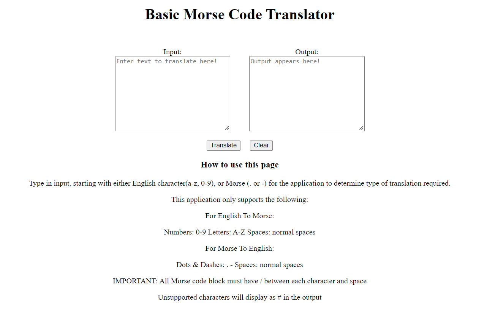

# MorseCoding

## Summary

This repo is for a simple Morse code translator, taking in either English language letters (Latin characters to be exact) and converting them to Morse code and displaying this via HTML.
The application also does the reverse, with characters outside of the parameters returned as #.

## Screenshot

## Objectives

Allow user to input dots and dashes to get English text out, and to input English text and to get dots and dashes out.

## Original Spec

> Project: Morse Code Translator
> Create a webpage that allows users to input english and get a more code output, and input morse code and get an english output
> MVP:
>
> - Must support the alphabet, spaces, numbers
> - Must give user feedback when they input unsupported characters
> - Must be able to translate both ways
> - Project must use javascript modules to seperate dom logic from vanilla js logic
> - Can use react, or vanilla js.
> - Functions you write must be unit tested (you won't be able to write unit tests for function that interact with the dom)
> - Must look NICE, this will go on your portfolio
> - Your project must have a README discussing the following:
>   - Screen shot of the app
>   - What your implement / thinking was
>   - How it works
>   - Why you chose to implement it this way
>   - What you would improve / focus on in the next iteration

## Layout of code

The project is broken into a number of different js files, along with a HTML page for user interaction and SCSS for minimal styling.

- index.html
  - used for displaying input and output fields, basic buttons and also instructions for operation.
- dom.js
  - used for interacting with the HTML page and getting infoormation from the input field and sending information to the output field.
    -style.scss
  - styling was kept simple to allow extendiblity of page, given the small size and limited use, this would be better in a larger site, and the minimal styling allows for easier integration.
- morseCode.js
  - This file is basically just a wrapper for the englishToMorse object used as a translation matrix for the code. The object is more reuseable and extendile, while at the same time allowing other objects to be used in place, to allow the code to run for other translations, ASCII code, for example.
- decoder.js
  - this is the main block of code and the one tested, as it does all the work other than DOM interactions. While not completely re-useable, there is at least a general framework for future work, on other code translations.

## Implementation

## Testing

Basic testing was included via jest, the need for this requirement also limited the code that could be tested (no DOM testing), but this could be rewritten in react, once the author is more familiar with testing react applications.
Tests can be run via CLI with "jest test".

## Installing

Installation via github would be to clone the repo and then to import any jest testing variables as needed. Node modules are ignored from the repo due to size and would require external installation for full feature use.

## How To Use

Operation is fairly straight forward:

1. User types in to the Input field the text they desire translated.
2. User clicks translate button
3. Output appears in output field.

Clicking clear removes anything in either input of output fields.
Only spaces, letters a-z and numbers 0-9 are compatible, all other characters will return '#' in the output.
If the input starts with a blank space or an incompatible character, an error is displayed (""ERROR! :Please see instructions for correct use").
For Morse code input: Each character is required to be seperated by a '/', with spaces inbetween slashes as needed.

## Future improvements

The code is rather strict in it's handling of user input and could be improved in a number of way:

- looser requirements for inputs
  -Allowing more natural typing/pasting
  -Allowing a wider character set
- possibly adding direct input of Morse, either with space bar or mouse clicks
- audio output because it was intended as a code that could be heard and understood
- while wildly ambitious, audio input could, in theory, be added, though this might be a project all of it's own.

## Reuse/Licence

I'm more than happy for anyone and everyone to steal this code and go wild with it. In fact, I'd prefer it.
If you do anything with it, let me know so I can check it out!
